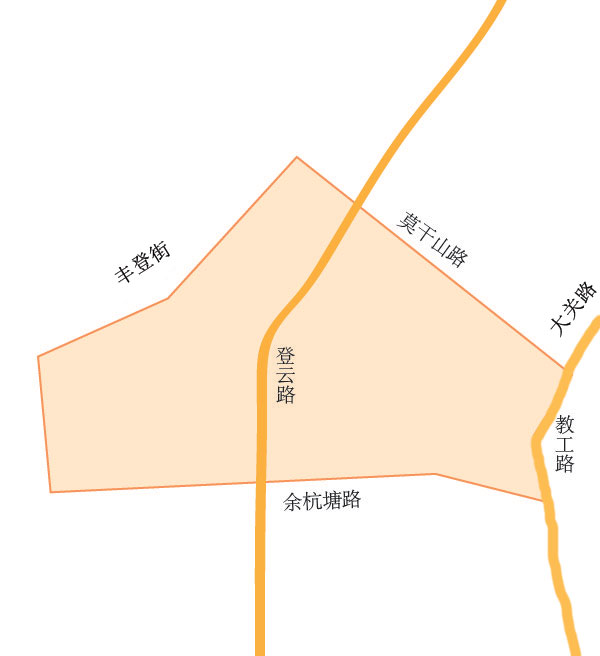

# 拱墅区教育地图

## 各教育集团颜色值
>大关中学教育集团：#1863af

>杭师大附属文晖教育集团：#007772

>文澜中学教育集团：#e9c14d

>锦绣育才教育集团：#031c6a

>卖鱼桥小学教育集团：#00a0de

>大关小学教育集团：#4d090c

>拱宸桥小学教育集团：#016584

>红缨学前教育集团：#eb5450

>蓓蕾学前教育集团：#12af7a

>文华学前教育集团：#b9da6e

    
董家校区<a href="#">视频链接</a>

    <button class="close">X</button>

    

        
    

    

        

            

                    直升小学
            

            

                    德胜小学、外语实验小学、大关苑第一小学、树人小学部分
            

        

        

            

                    电话
            

            

                    1111-2222
            

        

        

            

                    户籍儿童 教育服务区
            

            

                    1.余塘巷以北(浅水湾花园部分)，草营巷以南，湖墅路以西，莫干山路以东区域户籍适龄儿童;2.长板巷(夹城巷)以北，大关路以南，上塘高架以西，湖墅路以东区域(除昆仑公馆小区)户籍适龄儿童。3.大关路以北，上塘路以西，运河以东，登云路以南户籍适龄儿童。
            

        

        

            

                    随迁子女 教育服务区
            

            

                    1.余塘巷以北(浅水湾花园部分)，草营巷以南，湖墅路以西，莫干山路以东区域户籍适龄儿童;2.长板巷(夹城巷)以北，大关路以南，上塘高架以西，湖墅路以东区域(除昆仑公馆小区)户籍适龄儿童。3.大关路以北，上塘路以西，运河以东，登云路以南户籍适龄儿童。
            

        

    

    

        报名请携带报名材料：房产证及复印件、户口簿及复印件、预防接种卡！
    

